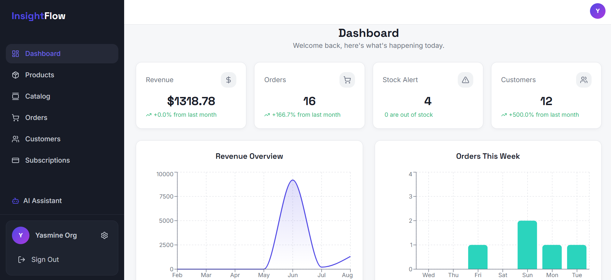
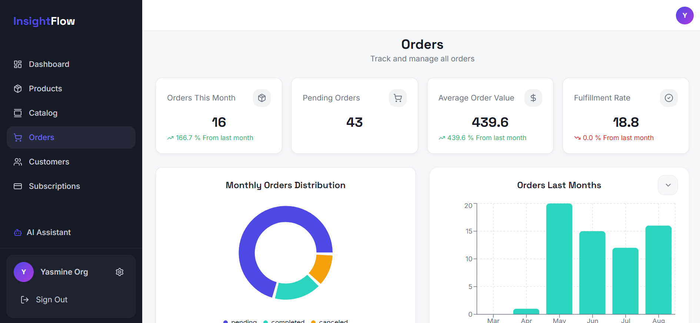
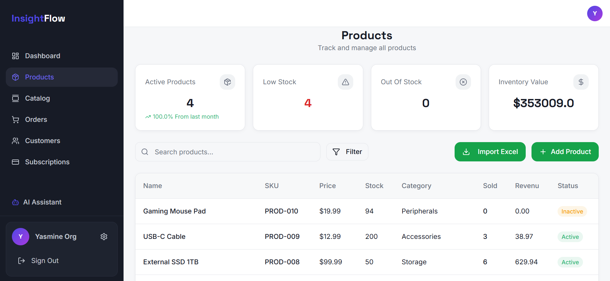
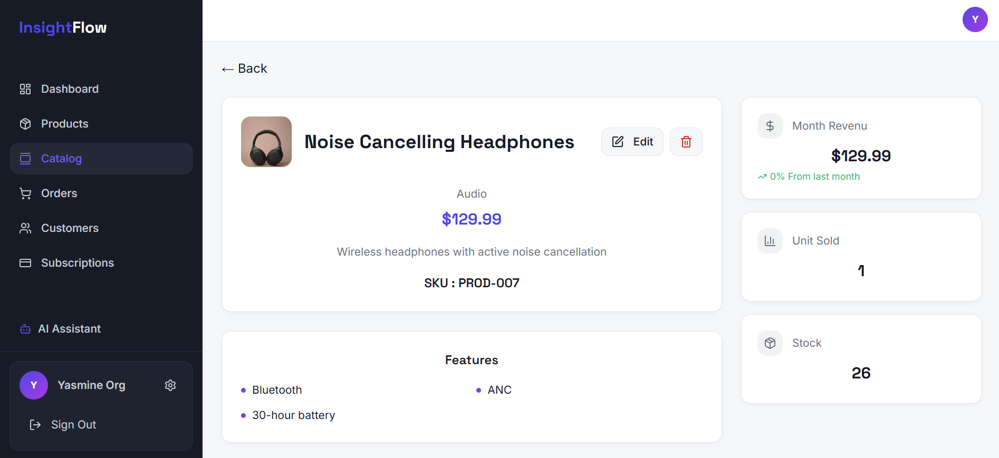
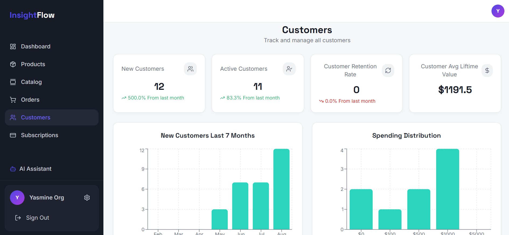

# InsightFlow

> A SaaS business intelligence platform that gives business owners a unified view of their performance — orders, revenue, customers, and products — with an AI-powered business assistant and organization-specific knowledge base.

---

## What is InsightFlow?

Most small business owners track their business across disconnected tools — an Excel sheet for orders, another for customers, manual revenue calculations. InsightFlow replaces all of that with a single dashboard powered by real analytics and an AI business assistant.

You get live KPIs, trend charts, and actionable insights calculated directly from your data using MongoDB's Aggregation Framework, combined with an AI agent that can analyze business data and answer questions about uploaded business documents.

The AI assistant supports:

* Business analytics through specialized tools
* Organization-specific document search
* Retrieval-Augmented Generation (RAG)
* Vector search with MongoDB Atlas
* Conversation context management and summarization
* Asynchronous document processing

---

## Preview

<div align="center">

### Dashboard


<p><em>Real-time analytics and business metrics overview</em></p>

---

### Orders


<p><em>Order management and fulfillment tracking table</em></p>

---

### Products


<p><em>Inventory and stock management interface</em></p>

---

### Catalog


<p><em>Product categorization and catalog structure</em></p>

---

### Customers


<p><em>Customer relationship management and details view</em></p>

</div>

---

## Features

### Dashboard

The command center of InsightFlow. Loads with a full business health overview on login.

* **KPI strip** — Revenue, Orders, Customers, Products with growth indicators
* **Charts** — Revenue trend over the last 7 months, orders this week
* **Recent activity** — Latest orders
* **Top performers** — Top customers by spend and top products by units sold
* **Responsive dashboard** — Designed for desktop and smaller screens

### Products

Full product catalog management with analytics built in.

* Add, edit, and delete products
* Product image upload and management
* Search, filter, and pagination
* Per-product revenue and units sold
* Stock alert system — low-stock and out-of-stock products flagged automatically
* Inventory value
* Active product count
* Organization-level SKU uniqueness

### Orders

End-to-end order tracking and analysis.

* Add, edit, and delete orders
* Filter by status: pending / completed / cancelled
* Search and pagination
* Order distribution chart
* Orders-this-week chart
* Average Order Value (AOV)
* Fulfillment rate
* Order growth trends
* Automatic stock updates when orders are processed

### Customers

Customer base management with retention analytics.

* Add, edit, and delete customers
* Search and pagination
* Active customers MTD
* Customer Lifetime Value (CLV)
* Retention rate
* Top customers by spend
* Customer growth chart
* Spending distribution

### Excel Import

Pro users can import business data in bulk instead of manually entering every record.

Supported imports:

* Products
* Customers
* Orders

The import system includes:

* `.xlsx` file parsing
* Required-field validation
* Data validation before insertion
* Duplicate detection
* SKU validation
* Organization-level data isolation
* Error reporting for invalid rows

An Excel template is also provided to help users prepare correctly formatted data before importing.

---

## AI Business Assistant

InsightFlow includes an AI-powered business assistant designed specifically for organization-level business analysis.

The assistant uses **LangGraph** to orchestrate conversations, tools, and document retrieval.

### Business Analysis Tools

The agent can access specialized tools for business questions, including:

* Customer analysis
* Product analysis
* Order statistics
* Inventory information
* Business KPIs
* Organization-specific analytics

For example:

```text
User:
Who are my top customers this month?

Agent:
Top customers this month:

1. younes — $649.87
2. Amine Meziane — $529.95
3. Yasmine Kaci — $99.99
4. Jane Smith — $38.97
```

The assistant is instructed to produce concise, clean responses rather than verbose conversational output.

### Dynamic Tool Selection

Tools are bound to the LLM based on the requested route/context instead of unnecessarily exposing every available tool for every request.

This reduces unnecessary context and helps the model select the appropriate business operation.

---

## RAG Knowledge Base

Organizations can upload business documents and ask the AI assistant questions about their contents.

The RAG pipeline works as follows:

```text
Upload document
       ↓
File stored
       ↓
Status: pending
       ↓
Background processing
       ↓
Extract document text
       ↓
Split into chunks
       ↓
Generate embeddings
       ↓
Store chunks + embeddings
       ↓
MongoDB Atlas Vector Search
       ↓
AI agent retrieves relevant passages
       ↓
Gemini generates the answer
```

### Document Processing

Uploaded documents are processed asynchronously using a background worker.

Files maintain processing states:

```text
pending
   ↓
processing
   ↓
ready
```

If processing fails:

```text
failed
```

This allows the frontend to display the current document state without blocking the upload request.

### Embeddings

Document chunks are converted into vector embeddings using a sentence-transformer embedding model.

Embeddings are stored alongside the document chunks and used for semantic similarity search.

Batch processing is used when generating embeddings to improve processing efficiency.

### MongoDB Atlas Vector Search

MongoDB Atlas Vector Search is used to retrieve semantically relevant document chunks.

Each vector search is scoped to the authenticated organization:

```text
organization_id
      ↓
Vector Search filter
      ↓
Only that organization's documents
```

This prevents one organization's knowledge base from being exposed to another organization.

The search returns relevant passages rather than entire documents, reducing the amount of context sent to the LLM.

### File Lifecycle

Deleting an uploaded file also removes:

* The Cloudinary file
* The MongoDB file record
* Associated document chunks
* Associated embeddings

The Vector Search index itself remains intact while the indexed documents are removed.

---

## AI Conversation Management

The AI agent uses LangGraph state management and checkpoints to maintain conversation history.

### Context Limiting

Long conversations can cause the LLM context to grow significantly, especially when tool results contain large datasets.

InsightFlow therefore limits the recent conversation context and summarizes older messages when the state exceeds a configured token threshold.

```text
Conversation grows
       ↓
Token threshold reached
       ↓
Summarize older messages
       ↓
Keep recent conversation
       ↓
Store summary in state
       ↓
Send smaller context to LLM
```

The summarizer preserves useful information such as:

* Important user requests
* Business context
* Relevant IDs
* Important dates
* Numerical results
* Conclusions
* Information needed for follow-up questions

Unnecessary greetings, repeated answers, raw tool arguments, and large database results are removed from the summarized context.

### LangGraph Checkpoints

Conversation state is persisted using LangGraph checkpoints, allowing conversations to survive application restarts.

The checkpoint system stores the state associated with a conversation thread rather than relying only on in-memory state.

---

## AI Model

InsightFlow uses Google's Gemini models through LangChain.

Current integration:

* Google Gemini
* `langchain-google-genai`
* LangChain tool calling
* LangGraph agent orchestration

The agent can perform multiple tool calls when necessary before producing the final response.

The application also handles provider errors such as:

* Rate limits
* API failures
* Invalid requests
* Model errors
* Temporary external-service failures

---

## Document Processing Queue

Document processing is separated from the normal API request using a background job queue.

```text
Node.js API
    │
    │ Upload
    ▼
MongoDB File
status: pending
    │
    ▼
BullMQ / Redis
    │
    ▼
Background Worker
    │
    ├── Extract text
    ├── Chunk document
    ├── Generate embeddings
    └── Store vectors
    │
    ▼
File status: ready
```

This prevents expensive document processing from blocking the Express request.

BullMQ is used for background jobs because it integrates naturally with the existing Redis infrastructure.

---

## Analytics Layer

InsightFlow's strongest feature. Every metric is calculated live via **MongoDB Aggregation Framework pipelines** — no stale data.

| Category  | Metrics                                                                  |
| --------- | ------------------------------------------------------------------------ |
| Revenue   | Total revenue, revenue growth, revenue trends                            |
| Orders    | Order count, order growth, AOV, fulfillment rate, order trends           |
| Customers | Active customers, retention rate, CLV, average lifetime value            |
| Products  | Product revenue, inventory value, low-stock alerts, active product count |

Growth percentages use **MTD vs same MTD last month** — comparing June 1–8 against May 1–8, not a full prior month, so the numbers are always a fair apples-to-apples comparison.

The same analytics layer is exposed to the AI agent through specialized tools, allowing users to ask natural-language questions about their business.

---

## Authentication & Authorization

InsightFlow supports multiple authentication mechanisms.

### Traditional Authentication

1. User registers with email and password
2. Password is securely hashed before storage
3. Login issues a signed JWT
4. JWT is attached to protected API requests
5. Server middleware validates the token
6. Protected resources are scoped to the authenticated organization

### Google OAuth 2.0

1. User selects **Sign in with Google**
2. Passport.js handles the OAuth 2.0 flow
3. New users are automatically created
4. Existing accounts can be linked to Google
5. A JWT is issued after successful authentication

### Account Security

* JWT-based authentication
* Protected API routes
* Authorization middleware
* Password hashing
* Email verification
* Password reset flow
* Google OAuth 2.0
* Organization-level data isolation

The AI knowledge base follows the same organization-level isolation rules.

---

## Subscription & Billing

InsightFlow uses **Stripe** for Pro subscriptions.

### Free Plan

Product management
Customer management
Order management
Dashboard
KPI calculations
Analytics
Unlimited records

### Pro Plan

Everything in Free, plus:

Excel bulk import — import products, customers, and orders from .xlsx files
Knowledge Base — upload up to 10 business documents
AI Assistant — ask questions about business data and uploaded documents
Daily AI message limit
Stripe subscription billing

### Subscription Lifecycle

Stripe Webhooks keep the application's subscription state synchronized with Stripe.

Handled lifecycle events include:

* Checkout completion
* Subscription activation
* Subscription updates
* Scheduled cancellation
* Subscription cancellation
* Payment-related subscription changes

The application distinguishes between:

```text
active
cancelling
cancelled
```

A user who schedules a cancellation keeps access until the end of the current billing period. The subscription is only marked as cancelled once Stripe confirms that the subscription has actually ended.

---

## Email System

InsightFlow integrates with the Gmail API for transactional emails.

Email functionality includes:

* Email verification
* Password reset emails
* Account-related notifications

OAuth 2.0 credentials are stored in environment variables and are never committed to the repository.

---

## Product Image Management

Product images are managed through **Cloudinary**.

The application supports:

* Image upload
* Image association with products
* Image deletion when a product is deleted
* Cloudinary resource cleanup

Cloudinary credentials are configured through environment variables.

---

## Data Management & Validation

The application validates data at both the frontend and backend layers.

Examples include:

* Required-field validation
* Email validation
* Phone validation
* SKU validation
* Duplicate customer detection
* Organization-level SKU uniqueness
* Stock validation
* Excel import validation

Backend validation is treated as the source of truth, preventing invalid requests from bypassing frontend validation.

---

## Performance & State Management

### React Query

React Query is used for server-state management and caching.

Examples include:

* Customer list caching
* Pagination-aware queries
* Search-aware query keys
* Stale-time configuration
* Automatic refetching
* Cache invalidation after mutations
* File processing status polling

When a document is pending or processing, the frontend automatically refetches the organization's files every few seconds until processing completes.

### MongoDB Aggregation

Analytics calculations are performed directly in MongoDB using aggregation pipelines.

This avoids loading large datasets into Node.js just to calculate:

* Revenue
* Growth percentages
* AOV
* CLV
* Retention
* Product performance
* Order statistics

### Rate Limiting

The application uses rate limiting to prevent excessive requests.

AI interactions are also subject to usage limits to control resource consumption and protect external LLM APIs from unnecessary traffic.

---

## Testing

InsightFlow uses **Playwright** for end-to-end testing.

The test suite covers important user flows such as:

* User authentication
* Dashboard access
* Product creation
* Product deletion
* Customer management
* Order workflows
* Protected routes
* UI success/error states

Playwright can automatically start the frontend and backend development servers before executing the tests.

Example:

```bash
npx playwright test
```

Test artifacts such as traces and reports are generated when tests fail, making debugging easier.

---

## Continuous Integration

GitHub Actions is used to automatically run the application's test suite.

The CI workflow:

1. Checks out the repository
2. Installs Node.js dependencies
3. Configures required environment variables
4. Starts the frontend and backend
5. Installs/validates Playwright browsers
6. Runs the end-to-end test suite
7. Uploads Playwright reports and traces when tests fail

This ensures that changes pushed to the repository are automatically tested before being considered stable.

Workflow:

```text
Git Push
   ↓
GitHub Actions
   ↓
Install dependencies
   ↓
Start frontend + backend
   ↓
Playwright E2E tests
   ↓
Test artifacts / report
```

---

## Health Check

The backend exposes a lightweight health-check endpoint that can be used to verify that the API is running.

Example:

```http
GET /api/health
```

A successful response confirms that the backend is available and responding to requests.

This can also be used by hosting platforms and monitoring systems to determine whether the backend service is healthy.

---

## Error Handling

The backend handles errors centrally and returns meaningful HTTP responses to the frontend.

The application distinguishes between common cases such as:

* Authentication failures
* Unauthorized requests
* Missing resources
* Validation errors
* Duplicate records
* Database errors
* Stripe errors
* External API errors
* LLM provider errors
* Rate-limit responses

The frontend displays appropriate success and error feedback to users instead of exposing raw backend errors.

---


## Tech Stack

### Frontend

| Tool          | Purpose                                  |
| ------------- | ---------------------------------------- |
| React         | UI framework                             |
| React Router  | Client-side routing and protected routes |
| Tailwind CSS  | Styling                                  |
| Axios         | HTTP client                              |
| React Query   | Server state management and caching      |
| Recharts      | Charts and data visualization            |
| Framer Motion | Animations and transitions               |
| Lucide React  | UI icons                                 |
| Playwright    | End-to-end testing                       |

### Backend

| Tool                   | Purpose                           |
| ---------------------- | --------------------------------- |
| Node.js                | Runtime                           |
| Express.js             | REST API server                   |
| JWT                    | Stateless authentication          |
| Passport.js            | Google OAuth 2.0                  |
| Axios                  | External HTTP requests            |
| Nodemailer / Gmail API | Transactional email functionality |
| BullMQ                 | Background job processing         |
| Upstash                | Managed Redis backend for queues  |

### AI & RAG

| Tool                        | Purpose                                  |
| --------------------------- | ---------------------------------------- |
| LangGraph                   | Agent orchestration and state management |
| LangChain                   | LLM and tool integration                 |
| `langchain-google-genai`    | Gemini integration                       |
| Google Gemini               | AI reasoning and response generation     |
| Sentence Transformers       | Document embeddings                      |
| PyMuPDF                     | PDF text extraction                      |
| MongoDB Atlas Vector Search | Semantic document retrieval              |
| FastAPI                     | AI/RAG service API                       |

### Database

| Tool                  | Purpose                          |
| --------------------- | -------------------------------- |
| MongoDB Atlas         | Cloud database and vector search |
| Mongoose              | Schema modeling and query layer  |
| Aggregation Framework | Analytics calculations           |
| MongoDB Vector Search | Semantic similarity search       |

### External Services

| Service         | Purpose                                |
| --------------- | -------------------------------------- |
| Stripe          | Subscription billing                   |
| Stripe Webhooks | Subscription lifecycle synchronization |
| Google OAuth    | Social authentication                  |
| Gmail API       | Transactional emails                   |
| Cloudinary      | Product image and document storage     |
| GitHub Actions  | CI and automated testing               |

---

## Architecture

InsightFlow now uses a multi-service architecture for the main SaaS application and AI/RAG processing:

```text
                         ┌──────────────────────┐
                         │      React Client    │
                         │                      │
                         │ React Query          │
                         │ React Router         │
                         │ Tailwind CSS         │
                         └──────────┬───────────┘
                                    │
                              REST / HTTP
                                    │
                                    ▼
                         ┌──────────────────────┐
                         │   Express.js API     │
                         │                      │
                         │ Authentication       │
                         │ Authorization        │
                         │ Business Logic       │
                         │ File Management      │
                         └───────┬───────┬──────┘
                                 │       │
                     ┌───────────┘       └──────────────┐
                     ▼                                  ▼
              ┌──────────────┐                   ┌──────────────┐
              │   MongoDB    │                   │ Cloudinary   │
              │              │                   │              │
              │ Users        │                   │ Images       │
              │ Products     │                   │ Files        │
              │ Orders       │                   └──────────────┘
              │ Customers    │
              │ Files        │
              │ Conversations │
              └──────┬───────┘
                     │
                     │
              ┌──────▼───────┐
              │ Redis/BullMQ │
              └──────┬───────┘
                     │
                     ▼
              ┌──────────────┐
              │ Document     │
              │ Worker       │
              │              │
              │ Extract      │
              │ Chunk        │
              │ Embed        │
              │ Store        │
              └──────────────┘

                         AI REQUEST
                              │
                              ▼
                     ┌──────────────────┐
                     │ FastAPI AI Agent │
                     │                  │
                     │ LangGraph        │
                     │ Gemini           │
                     │ Business Tools   │
                     │ RAG Tools        │
                     └───────┬──────────┘
                             │
                 ┌───────────┴───────────┐
                 ▼                       ▼
        ┌─────────────────┐      ┌──────────────────┐
        │ Business Tools  │      │ Vector Search    │
        │                 │      │                  │
        │ Customers       │      │ MongoDB Atlas    │
        │ Products        │      │ Vector Search    │
        │ Orders          │      │                  │
        │ Analytics       │      │ Document Chunks  │
        └─────────────────┘      └──────────────────┘
```

### Request Flow

For a normal business question:

```text
React
  ↓
Express
  ↓
FastAPI Agent
  ↓
LangGraph
  ↓
Gemini
  ↓
Business Tool
  ↓
MongoDB
  ↓
Gemini
  ↓
Express
  ↓
React
```

For a document question:

```text
React
  ↓
Express
  ↓
FastAPI Agent
  ↓
LangGraph
  ↓
Gemini
  ↓
RAG Tool
  ↓
Embedding Model
  ↓
MongoDB Atlas Vector Search
  ↓
Relevant Document Chunks
  ↓
Gemini
  ↓
Answer
```

---

## Project Structure

```text
insightflow/
├── client/
│   ├── public/
│   ├── src/
│   │   ├── components/      # Reusable UI components
│   │   ├── pages/           # Route-level pages
│   │   ├── hooks/           # React Query hooks
│   │   ├── lib/             # Axios instance and helpers
│   │   └── context/         # Auth context
│   ├── tests/               # Playwright tests
│   ├── playwright.config.js
│   └── ...
│
├── server/
│   ├── Routes/              # API routes
│   ├── Models/              # Mongoose schemas
│   ├── Middleware/          # JWT auth and middleware
│   ├── Queries/             # MongoDB aggregation pipelines
│   ├── Workers/             # Background document processing
│   ├── Config/              # Database and Passport configuration
│   └── ...
│
├── .github/
│   └── workflows/
│       └── playwright.yml   # CI / E2E testing
│
└── ...
```

---

## Getting Started

### Prerequisites

* Node.js 20+
* Python 3.10+
* MongoDB Atlas with Vector Search
* Upstash Redis account
* Stripe account for Pro subscriptions
* Google Cloud OAuth credentials for Google Sign-In
* Gemini API key
* Cloudinary account for product images and files
* Stripe CLI for local webhook development

### Installation

```bash
# Clone the repository
git clone https://github.com/your-username/insightflow.git

cd insightflow

# Install server dependencies
cd server
npm install

# Install client dependencies
cd ../client
npm install

# Install AI service dependencies
cd ../agent
python -m venv venv

# Windows
venv\Scripts\activate

# Install Python dependencies
pip install -r requirements.txt
```

### Environment Variables

Create a `.env` file inside `/server`.

Example:

```env
PORT=5000

MONGO_URI=your_mongodb_connection_string

JWT_SECRET_KEY=your_jwt_secret

STRIPE_SECRET_KEY=your_stripe_secret_key
STRIPE_PRICE_ID=your_stripe_price_id
STRIPE_WEBHOOK_SECRET=your_stripe_webhook_secret

CLOUDINARY_CLOUD_NAME=your_cloudinary_cloud_name
CLOUDINARY_API_KEY=your_cloudinary_api_key
CLOUDINARY_API_SECRET=your_cloudinary_api_secret

GOOGLE_CLIENT_ID=your_google_client_id
GOOGLE_CLIENT_SECRET=your_google_client_secret
GOOGLE_REFRESH_TOKEN=your_google_refresh_token
GOOGLE_REDIRECT_URI=your_google_redirect_uri

GMAIL_SENDER=your_sender_email

CLIENT_URL=http://localhost:5173
SERVER_URL=http://localhost:5000

AGENT_API_URL=http://localhost:8000

NODE_ENV=test
REDIS_URL=your_upstash_redis_url
```

Create the AI service environment variables according to the deployment configuration:

```env
GOOGLE_API_KEY=your_gemini_api_key
MONGO_URI=your_mongodb_connection_string
```

---

## Running Locally

### Start frontend

```bash
cd client
npm run dev
```

### Start backend

```bash
cd server
npm run dev
```

### Start AI service

```bash
cd agent

# Activate environment on Windows
venv\Scripts\activate

# Start FastAPI
uvicorn app.main:app --reload
```

### Start Redis / Worker

Start Redis and the document processing worker according to the local BullMQ/Redis configuration.

The main services are:

```text
Frontend     → http://localhost:5173
Backend      → http://localhost:5000
AI Agent     → http://localhost:8000
Upstash Redis → Cloud-hosted Redis
```

Health check:

```text
http://localhost:5000/api/health
```

---

## Stripe Webhooks During Local Development

For local Stripe webhook development, install the Stripe CLI and run:

```bash
stripe listen --forward-to localhost:5000/api/subscription/webhook
```

The CLI provides a temporary webhook signing secret. Configure that secret as:

```env
STRIPE_WEBHOOK_SECRET=whsec_...
```

For production, Stripe should send events directly to the deployed backend webhook URL rather than using Stripe CLI forwarding.

---

## Analytics Deep Dive

All metrics are computed with MongoDB aggregation pipelines. Growth indicators compare the current MTD window against the identical window in the prior month.

```js
// Current MTD
{
  $match: {
    createdAt: {
      $gte: startOfMonth,
      $lte: today
    }
  }
}

// Same window last month
{
  $match: {
    createdAt: {
      $gte: startOfLastMonth,
      $lte: todayLastMonth
    }
  }
}

// Growth %
((current - previous) / previous) * 100
```

This avoids comparing a partial current month against a full previous month, which can produce misleading growth percentages.

---

## Deployment

The application is designed to be deployed as separate frontend, backend, and AI services.

Typical deployment architecture:

```text
                 ┌───────────────────┐
                 │  Frontend Hosting │
                 │   React / Vite    │
                 └─────────┬─────────┘
                           │
                           │ HTTPS
                           ▼
                 ┌───────────────────┐
                 │  Backend Hosting  │
                 │ Node.js + Express │
                 └───────┬─────┬─────┘
                         │     │
              ┌──────────┘     └─────────────┐
              ▼                              ▼
      ┌───────────────┐             ┌────────────────┐
      │ MongoDB Atlas │             │ AI Service     │
      │               │             │ FastAPI        │
      │ Business Data │             │ LangGraph      │
      │ Documents     │             │ Gemini         │
      │ Vectors       │             │ RAG            │
      └───────────────┘             └───────┬────────┘
                                            │
                                      ┌─────┴─────┐
                                      ▼           ▼
                                  MongoDB      Gemini
                                  Vector       API
                                  Search
```

Background document processing runs asynchronously through BullMQ workers using Upstash Redis as the managed queue backend.f

Production environment variables are configured through the hosting provider rather than committed to the repository.

---

## Engineering Highlights

InsightFlow demonstrates several production-oriented engineering practices:

* RESTful API architecture
* Multi-service architecture
* JWT authentication and authorization
* Google OAuth 2.0
* Organization-level data isolation
* MongoDB aggregation pipelines for analytics
* React Query server-state caching
* Pagination and search
* Excel bulk import and validation
* Cloudinary image and file lifecycle management
* Stripe subscription lifecycle management
* Stripe webhook synchronization
* Transactional email integration
* LangGraph agent orchestration
* Gemini LLM integration
* Tool calling
* Business-specific AI tools
* Retrieval-Augmented Generation (RAG)
* Sentence-transformer embeddings
* MongoDB Atlas Vector Search
* Organization-scoped semantic search
* Asynchronous document processing
* BullMQ and Redis
* File processing state management
* Automatic document-chunk cleanup
* Conversation context limiting
* Automatic conversation summarization
* LangGraph checkpoint persistence
* AI rate limiting
* Automated Playwright E2E testing
* GitHub Actions CI
* Environment-based configuration
* API health checks
* Responsive UI
* Centralized error handling
* External service integrations

---

## License

This project is for portfolio and educational purposes.
